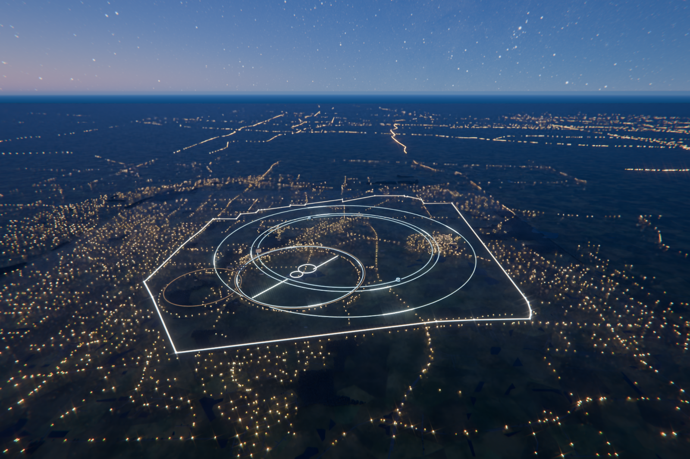
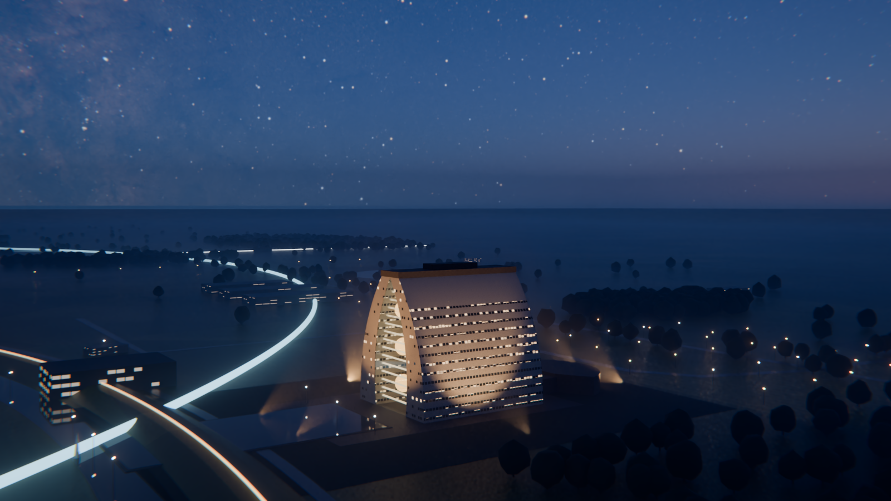

# FermilabMuCBlender

A procedurally built Blender scene of the Fermilab site at twilight with the
proposed 10 km muon collider drawn as a luminous beamline, rendered in Cycles
for presentation- and cover-quality stills. The sky is the real one for a
chosen instant, computed from a NASA star catalogue map.



*The whole complex at civil twilight: the real campus boundary highlighted,
the proposed chain in cyan — collider, three synchrotrons on IMCC
circumferences and a 14.5 km site-filler final stage — and the existing
Tevatron and Main Injector in amber.*



Everything in the frame is generated by the scripts in `scene/`: Wilson Hall,
the accelerator rings, water, roads, lamps, buildings, trees, fog, sky and
camera. The site's *geometry* -- boundary, terrain, water, woods and roads --
is measured from OpenStreetMap and a public elevation model rather than drawn
by hand (see **Site geometry**). Only the surface textures and the sky HDRI are
downloaded (all CC0, see `assets/MANIFEST.md`).

OpenStreetMap data is ODbL: the figure's credit line carries the attribution.

## Render

Requirements: Blender 5.x on `PATH` (or `BLENDER=/path/to/blender`), Python 3
for the asset fetcher. Previews render fine on a 4-core CPU; the final frame
is meant for a GPU workstation (`--gpu` auto-selects OptiX/CUDA/HIP/Metal).

```sh
# once per machine
python3 tools/fetch_assets.py                            # ~250 MB: CC0 textures, Poly Haven skies, NASA star map
blender -b --python tools/make_sky_hdri.py -- --res 8k   # -> assets/hdri/fermilab_night_sky.exr (~1 min)

./render.sh --preview                                    # 640x360 look-dev pass (~1 min, CPU is fine)

# final renders on a GPU workstation
./render.sh --gpu --final --out renders/fermilab_muc_twilight.png   # 3840x2160, 1024 spp
./render.sh --gpu --final --camera overview \
    --out renders/fermilab_site_overview.png             # whole complex, campus boundary highlighted
./render.sh --gpu --final --camera cover --res 2400x3600 \
    --out renders/fermilab_muc_cover_portrait.png        # magazine-cover crop, Milky Way arch over the building
```

For the 4K stills use `--res 16k` when building the sky so the star field stays
sharp at 100 %. `--gpu` prints the backend and device names it selected; if it
reports no GPU it falls back to CPU rather than failing.

A final render **ends on the noise threshold, not on the sample count**:
`--final` sets Cycles' adaptive threshold to 0.01, so each pixel stops being
sampled once its estimated noise falls below 1 %. The 1024 samples are a
ceiling and a backstop — most pixels converge well before it. Lower the
threshold for a cleaner, slower frame (`--adaptive-threshold 0.005`), raise it
for a faster, grainier one.

`render.sh` forwards flags to `scene/build_scene.py`; read its docstring for
the full list (camera presets, sky mode, fog density, exposure, samples,
`--save-blend out/scene.blend` to keep an editable `.blend` with relative
asset paths that you can open on another machine after fetching the assets).

Look-dev loop: render a preview, then `python3 tools/render_sheet.py out/preview.png`
writes a sheet with the frame, three zoomed crops and a luminance histogram
with clipping percentages.

## The sky

`tools/make_sky_hdri.py` builds the star field from NASA/GSFC's *Deep Star
Maps 2020* (1.7 billion Gaia/Hipparcos/Tycho stars, equatorial coordinates,
public domain). It computes local sidereal time and the solar position for
Fermilab (41.8319 N, 88.2560 W) at the requested UTC instant, rotates the map
into the local horizon frame, adds a faint airglow floor and the
light-pollution domes of Chicago, Naperville, Aurora and the Fox Valley
towns, and writes an equirectangular EXR in Blender's world convention plus a
JSON sidecar.

The default instant is **19:32 CDT on 9 September 2026** (00:32 UTC the 10th):

| | Altitude | Azimuth |
|---|---|---|
| Sun | −4.4° (civil twilight) | 281° WNW |
| Galactic centre | 19° | 181° S |
| Polaris | 41.8° | 0° N |

That is the moment the scene renders by default: a warm band still sits along
the western horizon, there is enough skylight to read the prairie, and the
galactic centre is up in the south. Note that a real camera would not record
the Milky Way this early in twilight — the star field is added at full
strength so it stays visible, and `--star-scale` dials that back. The script prints the whole
reference table and verifies that each bright star lands on a bright pixel of
the output, so the orientation is checked rather than assumed. Move the
instant with `--utc 2026-07-20T04:00` (any ISO time) and the scene follows —
`--sky twilight` reads the sun's elevation and azimuth back out of the sidecar,
so the twilight glow and the stars always describe the same moment. Use
`--res 16k` for the 443 MB source when rendering above 4K.

Sky modes (`--sky`):

* `twilight` (default) — physical Nishita sky with the sun below the horizon
  **plus** the real star field added on top. Radiance adds, so the stars
  survive only where the twilight sky is dark, which is what happens in
  reality. This is the mode that lets you read the landscape.
* `milkyway` — the star field alone: full astronomical night, site lit only
  by its own lights.
* `nishita` — the twilight sky alone, no stars.
* `hdri` — a Poly Haven sky HDRI, rotated by `--sky-rot`.

## Site geometry

The site's own geometry is measured, not drawn from memory. `tools/fetch_geodata.py`
pulls OpenStreetMap through Overpass, `tools/fetch_dem.py` pulls an elevation
model from AWS Terrain Tiles, and `tools/bake_geodata.py` reduces both to
`assets/plan/site_plan.json` and `assets/plan/dem.png`, which are committed so
a render on another machine cannot silently differ.

```sh
python3 tools/fetch_geodata.py --essential   # per-layer cached; --layer <name> to retry one
python3 tools/fetch_dem.py                   # 60 km terrain square
python3 tools/bake_geodata.py                # -> assets/plan/
```

Three things this corrected, each of which had been guessed:

* **The origin was 701 m out.** The metric frame was pinned to a Wilson Hall at
  41.83203 N, −88.26136 E; OSM's Wilson Hall building has its centroid 701 m
  north of that, so every position in the scene carried the offset.
* **The boundary was 24 % too small.** The hand-drawn nine-vertex polygon
  enclosed 20.69 km², against a site labelled 27 km² / 6800 acres. The real
  36-vertex outline measures 27.66 km² / 6834 acres. It also settles the
  orientation: the south edge is a single 3003 m straight run and the north is
  short irregular segments, so the flat side is the south.
* **The Main Injector was 1.2 km from where it is.** Both existing rings are
  now least-squares circle fits to the features that physically trace them,
  with the residual recorded so the fit can be judged rather than trusted —
  the Tevatron from 173 pooled Outer Ring Road vertices (fitted r 975 m, rms
  57 m), the Main Injector from the 55-vertex Main Injector Pond arc (fitted
  r 644 m, rms 11 m). Each is drawn at the radius its published circumference
  implies.

The terrain is the real DEM, which is also why there are no mountains on the
horizon: relief within 6 km of the site is 85 m and the campus itself is flat
to about a tenth of a metre. What the horizon does have is long-wavelength
moraine relief — 267 m across the 60 km box, rising to the north-west — and
inventing peaks would have replaced the one thing the terrain contributes.

## Ring sizes

Radii come from the IMCC *Tentative Parameter list for the International Muon
Collider Collaboration*, 30 October 2023 ([indico.cern.ch event
1313021](https://indico.cern.ch/event/1313021/contributions/5623393/)) —
Table 3.10 for the acceleration chain, 3.19 for the collider, 3.2 for the
proton-driver compressor — as circumference / 2π:

| Stage | Circumference | Radius | |
|---|---|---|---|
| Collider (10 TeV) | 10 000 m | 1591.5 m | |
| RCS 1 and RCS 2 | 5 990 m (one shared tunnel) | 953.3 m | in the Tevatron tunnel |
| RCS 3 | 10 700 m | 1702.7 m | |
| RCS 4 | **14 501 m** | **2307.9 m** | site filler, not the IMCC 35 000 m |
| Compressor ring | 300–900 m | 47.7–143.2 m | |

Two things fall out of putting the document's numbers on the *measured* site:

* **RCS 1 and 2 fit the Tevatron tunnel.** 5990 m against the Tevatron's
  6283 m is a 5 % difference, so reusing that tunnel is quantitatively
  supported rather than rhetorically convenient. They are therefore drawn *on*
  the Tevatron's own circle — claiming reuse while drawing a separate ring
  47 m inside it was an inconsistency a reader could measure off the scale bar.
* **RCS 4 is a site filler.** The IMCC reference is 35 000 m, which is 11.1 km
  across against a site 5.7 × 6.2 km: drawn at that size it left the property
  on all four sides and was the largest, brightest curve in the frame, so the
  composition's dominant gesture was the one element contradicting the figure's
  own claim. This design instead sizes the final synchrotron to the site. The
  largest circle inscribed in the real boundary has r 2558 m; less a 250 m
  setback from the property line that is r 2308 m, **circumference 14.50 km**,
  computed in `tools/bake_geodata.py` rather than chosen. A 14.5 km final stage
  needs more acceleration turns than the 35 km reference — a trade the figure
  states rather than hides. With it, the whole chain fits on the campus.

The 3 TeV option (collider 4.5 km) needs a correspondingly smaller chain.

## Labelled figures

`tools/annotate.py` composes a presentation figure over a finished render:
callouts on dog-leg leaders, a title block, a categorical key, a beam-sequence
ribbon, a two-axis graphic scale and a provenance footer.

```sh
./render.sh --gpu --final --camera overview \
    --annotations out/overview.json --out renders/site_overview.png
python3 tools/get_fonts.py                       # once: self-hosted IBM Plex TTFs
python3 tools/annotate.py renders/site_overview.png \
    --anno out/overview.json --layout overview --formats png,pdf,svg --strict
```

Blender's compositor has no text node, so annotating *inside* Blender would
mean 3D text objects that get lit, fogged and perspective-warped, with almost
no typographic control. Keeping Cycles for the beauty pass and annotating in
2D is both the studio practice and the only route to real type — and the PDF
and SVG stay editable in Illustrator or Inkscape.

What keeps it honest rather than decorative:

* **The layout checker measures what actually goes wrong.** An earlier version
  tested pairwise text overlap and a 2 px trim clip, and printed "spacing OK"
  for a figure in which six blocks hung up to 48 px past the left margin and
  nine pairs of leaders crossed. A guard that measures the wrong quantity is
  worse than none, because it licenses the belief that the layout was checked.
  It now also asserts the margin and tests leader-against-leader as real
  segment intersections. `--strict` makes any finding a build failure.
* **Labels cannot drift off their subjects.** `build_scene.py --annotations`
  projects each anchor through the render camera itself and writes normalised
  coordinates, so the layout is resolution-independent and a moved camera
  moves the leaders with it.
* **Sides and order are computed, not typed.** Every anchor in this view sits
  between x 0.20 and 0.60, so a fixed two-column assignment sent leaders back
  across the frame. Each callout takes the column its own anchor is nearer,
  ordered by anchor height, which makes crossings geometrically impossible:
  monotonic within a column, opposed between columns. The ladder is sized to
  its own anchor field rather than to a fixed share of frame height.
* **Beam order is stated, not implied.** Because the ladder is ordered by
  geometry, its stacking carries no sequence — so the sequence lives in a
  ribbon along the bottom that reads 1 → 6. Stacking order had previously
  implied the chain, and implied it backwards.
* **The graphic scale shows its own anisotropy.** A perspective view has no
  single scale, and this projection is anisotropic 2.37:1. A single horizontal
  bar calibrated on the east rate — which is what was here — reported 1.34 km
  for a ring 3.18 km across. It is now an L with both legs at their true
  projected lengths, which makes the foreshortening visible instead of
  apologised for, and makes a separate north needle redundant.
* **Numbers are derived from the geometry drawn.** Circumferences are computed
  from the radii in the scene and the boundary's area from its polygon, in km,
  so the one number a reader can check against the drawing cannot disagree
  with it.
* **Type does the hierarchy.** One family (IBM Plex Sans) on a real 1.25
  modular scale — an earlier comment claimed 1.25 while delivering ratios of
  1.04 to 1.06 between five sizes crammed into 8–12 pt, then a single 2.17×
  leap to the title. Colour attaches to the name, which is the identifier,
  rather than to the metric, and the key names white as a category so it reads
  as a class rather than a missing colour.
* **Leaders are subordinate to the drawing.** They were drawn in the accent
  hues at the same weight as the accelerator geometry, so a cyan leader
  crossing a cyan tunnel was indistinguishable from it. They are now one
  neutral grey at 0.6 px, launched from a common knee gutter, with the
  category colour left on the survey mark where the leader touches its subject.

The figure's framing is chosen the same way: `--camera overview` comes from
projecting the real boundary and the largest rings through a pinhole model and
scoring subject size, sky band, scale uniformity and the bands the annotation
layer reserves. See the comment on the preset in `scene/camera_rig.py`.

The model is validated against Blender's own projection dump and agrees to
0.1 px. It did not always: for several rounds its `shift_y` sign was inverted,
and because the scale and the horizontal axis matched to four decimals nothing
looked wrong. What it cost was the sky — at the framing that error produced the
true horizon sat above the top of the frame, so ground filled the picture and
the bright specks along the top edge were distant street lamps, not stars.
Anything this model asserts about a framing is worth checking against the dump.

One constraint is worth stating because it drives the rest: the site outline
must fall *between* the two callout columns, not merely avoid colliding with
them. That is what sets the lens. Trimming the label copy to a measured 168 px
widest block is what made it affordable — the columns then need 0.115 of the
width each and the drawing gets the middle 64 %. Wanting the subject to fill
the frame and wanting the text clear of it are opposed; this figure chooses the
latter.

## What is in the scene

| Layer | How it is built |
|---|---|
| Wilson Hall | Two lofted towers following `y = 34 - 25 t^2.3` (outer face) so they lean in and meet at the roof; procedural facade with per-floor ribbon windows, randomly lit offices (2700-4200 K), board-formed concrete texture; glazed atrium ends with lit balcony edges; Ramsey Auditorium, plaza, reflecting pond, hyperbolic obelisk, five warm floodlights |
| Existing accelerators | Tevatron berm (r = 1000 m at (835, −735), fitted to the Outer Ring Road) with inner cooling-pond ring and a faint amber crest marker; Main Injector berm (r = 528 m at (−533, −1154), fitted to the Main Injector Pond arc) with its own marker |
| Muon collider chain | The stages the machine needs, at the IMCC's own circumferences (see below): proton driver complex (linac, accumulator and compressor rings, service halls), pion target hall, an ionisation cooling channel drawn as discrete modules on a bright beamline, the RCS acceleration chain, and the collider ring with two detector halls at opposite interaction points. Ring sizes are the document's; siting on the campus is ours and indicative |
| Site boundary | The real 36-vertex OSM outline (27.66 km² / 6834 acres) as a glowing ground ribbon with vertex markers, kept dimmer than the beamlines so the hierarchy reads collider > Tevatron > boundary; excluded from diffuse/glossy/volume rays so it marks the site without lighting it. Disable with `--no-boundary` |
| Site | Terrain on a 384² grid over 60 km displaced by a real DEM, with a flat apron carrying the ground out to the 167 km horizon so its own edge does not show as a seam (Grass004 x Ground037, Voronoi field parcels varying in brightness and hue, tallgrass tint); 431 mapped water bodies with Fresnel water and wind-stretched ripples, each laid flat at its own centroid's ground height; 6289 mapped road segments draped on the terrain; pole lamps on every mapped road inside the real site boundary plus minor roads out to 6.5 km, then bare emissive points out to 12 km, thinned with distance; ancillary buildings with hashed lit windows; ~27,000 instanced trees scattered on a jittered grid inside 114 mapped wood and forest polygons, trunks dropped beyond 3.5 km where they are sub-pixel (optional distant town-glow strips via `--towns`) |
| Fermilab Village | The real cluster on the east side of the campus, found as the densest group of mapped footprints inside the boundary (Users Center, Dormitories 1–4, Aspen East, around (3300, 550)). About 100 footprints carry warm 2850 K lit windows, with a denser LED street and lot grid, so the one inhabited part of the site reads as inhabited |
| Atmosphere | Physical twilight sky plus the astronomically placed Milky Way and Chicago-area sky glow (see above); homogeneous aerial haze in an 80 km box; a 9 km ground-fog box with exponential height falloff and noise pools (anisotropic forward scattering); optional moon (`--moon`) |
| Camera | Full-frame 24-40 mm, depth of field on Wilson Hall; presets `northeast` (default: over the reflecting pond toward the galactic core), `overview` (2.6 km up and 5.9 km south on a 24° depression at 18 mm, chosen by projection search — see the preset's comment), `cover` (portrait crop of the northeast vantage), `overlook`, `aerial`, `east`, `aerial_wide`, `high`, `low` (with bokeh prairie grass in the foreground), `portrait` |
| Look | Cycles with adaptive sampling, path guiding, light tree, OpenImageDenoise; AgX "Punchy"; compositor bloom (two passes), faint chromatic aberration, vignette |

## Look-dev notes

Things that were not obvious and are easy to undo by accident:

* **No World volume.** Cycles treats a World volume as infinite, so it
  attenuates the HDRI background and every sun lamp to nothing. The aerial
  haze is a bounded 80 km box (`atmosphere.build_haze`) instead.
* **Haze stays thin at night.** There is little light for it to scatter, so a
  thick layer absorbs starlight and sky glow and simply darkens the frame.
  Depth comes from the ground fog and from light falloff, not from haze.
* **Sun elevation, not exposure, is what makes the landscape readable.** At
  nautical twilight (sun below about −6°) the prairie renders essentially
  black, because that really is only a few lux; pushing exposure lifts the
  noise floor with it. An exposure ladder on the overview camera settled this:
  civil twilight (−4.4°) at 1.6 stops beats −6.8° at 3.0 stops. The cost is
  fainter stars. Exposure still has a band worth using: the twilight default is
  now 2.0 stops with a 1.3 sky multiplier, which on a measured sweep takes the
  ground from 30 against a sky of 28 to 46 against 55. A further stop reaches
  58 but flattens the picture into blue-grey.
* **Wide shots and close shots want different scene furniture.** The boundary
  ribbon and the town-glow strips both look right from above and wrong from
  down low (a streak along the horizon; a dark bar across the ground), so both
  are gated — `--boundary auto` by camera, `--towns` off by default.
* **Emitters are dual-strength.** `common.emissive_material(..., camera_strength=)`
  drives the visible core off `Light Path > Is Camera Ray`, so the collider
  tube and the lamps can look bright without dumping that much light into the
  fog. Raise `camera_strength`, not `strength`, to make something read brighter.
* **The facade is mostly concrete.** Windows occupy 1.4 m of each 4.5 m storey
  and only ~42 % of offices are lit; the form is carried by the floodlights.
  Widening the band or raising `window_emission` turns the building into a
  lantern very quickly.
* **The compositor runs on CPU** (`postfx.build_compositor`) because the GPU
  compositor needs a GL context that headless machines often lack. It is a
  small fraction of frame time.

## Layout

```
scene/            build_scene.py (entry), common.py, wilson_hall.py, site.py,
                  geo.py, atmosphere.py, camera_rig.py, postfx.py
tools/            fetch_assets.py, make_sky_hdri.py, render_sheet.py,
                  fetch_geodata.py, fetch_dem.py, bake_geodata.py,
                  annotate.py, get_fonts.py
assets/plan/      site_plan.json, dem.png -- the baked, committed site geometry
assets/           MANIFEST.md (+ downloaded textures/, hdri/, starmap/, geo/, git-ignored)
renders/          final images
```
